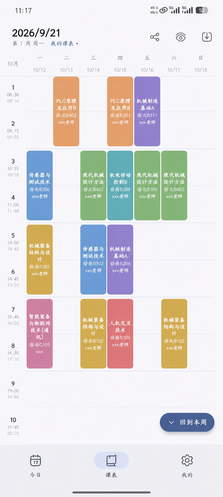
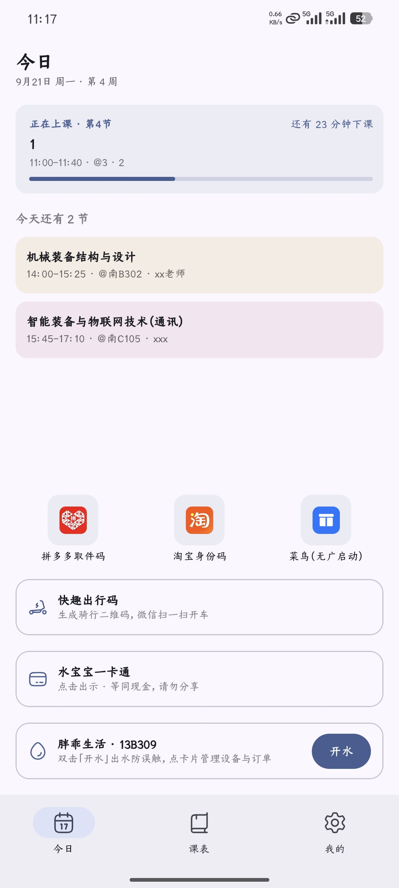

# JUWP Schedule（水贝贝）

江西水利电力大学的课表 Android App —— 水专也有自己的 App 了！

[](https://github.com/Inonvation/JUWP-Schedule/actions/workflows/android-ci.yml)
[](LICENSE)

 

> **非学校官方应用**，学生自用学习项目，详见文末[免责声明](#免责声明)。

## 功能

**课表**

- 一键从教务系统导入学期课表：自动依次读取**理论课表**与**实验课表**，导入前先给出识别结果
- 两张课表**合并进同一张课表**（按课程名+星期+节次+类型去重），**考试安排**同样可一键导入
- 上课提醒、系统日历同步、调课规划
- 课表页可换自定义背景图

**成绩**

- 一键导入全部学期成绩，按学期 / 学年分组，自动计算加权平均分与平均绩点
- 首次登录教务成功后、以及之后每次冷启动自动补一次（7 天内不重复请求，失败保留旧数据）

**笔记与作业**

- 笔记·课件：按课程归类，Markdown 正文 + TeX 公式，可插入图片
- 作业清单：按课程分组，记录截止日期与完成状态
- 作业截止提醒：截止前一天 20:00 与当天 20:00 各提醒一次未完成的作业

**学业完成情况**

- 抓取教务「学业达成情况」，按课程体系 / 课程性质 / 课程属性 / 公选课类别四个维度展示培养方案达成度（要求 / 已修 / 在修 / 还需学分）与课程明细
- 与成绩一起自动导入，同样 7 天闸门

**桌面小组件**

- 课表 / 校园卡 / 电费三条目：点课表条目进 App，点校园卡条目出全屏付款码，点电费条目进用电统计
- 校园卡条目可在设置里隐藏余额；小组件自身不联网取数，读数跟随 App 内的更新

**扩展功能**

- 学工表单：**宿舍报修**与**请假**打开即到表单，填写、照片/附件上传、提交与进度查询都在 App 内完成；
  走学校统一身份认证，与教务同一套账号，登录过教务导入的话通常免登
- 生活页（底栏「生活」）：一卡通余额、付款码、**寝室剩余电量**、充值入口与最近流水收在一页，
  付款码默认不预取（点一下才显示），电费充值跳缴费平台网页完成；可在「我的 → 通用」关掉这一页
- 胖乖生活：一键开水、余额查询、订单记录
- 快趣出行码：输入车号生成骑行二维码，也可在**内置地图**上看附近有哪些车、点一下自动填车号；一键拉起微信扫一扫，扫完返回后自动删除相册中的二维码图片
- 校园卡付款码：一键出示，喝水吃饭、寝室门禁不再需要水宝宝！支持查看一卡通余额与历史账单，凭证加密存本机，可随时关闭
- 取快递快捷方式：一键直达拼多多取件码、淘宝身份码与菜鸟（无广告启动），排队取快递不再匆忙
- 盖章成绩单：从教务签章系统导出带学校电子章的 PDF 成绩单，存本机，可在「最近导出」里重看或分享

**导入与备份**

- 课表、学期配置、作息、成绩与学业完成情况支持 JSON 备份，可随时导出与导入；笔记与作业不在该份备份里

## 使用

课表默认为空、不预置样例：

- 课表：**我的 → 课表 → 教务导入**，登录教务导入学期课表
- 成绩：**我的 → 学习 → 成绩查询**页内导入
- 学业完成情况：**我的 → 学习 → 学业完成情况**（登录教务成功后自动抓一次，7 天内不重复）
- 笔记与作业：**我的 → 学习**；也可在课表页或今日页点某节课，直接进这门课的笔记与作业
- 考试：在教务导入 WebView 内打开考试安排页，一键导入
- 盖章成绩单：**我的**页账户条进入教务账户页 → 「导出盖章成绩单」；成绩页也有入口
- 桌面小组件：**我的 → 小组件与日历 → 桌面小组件**，支持在应用内一键添加到桌面
- 免责声明：首启引导第一步有入口，之后在 **我的 → 关于 → 免责声明**；弹窗条文与本文一致，另有一条只在 App 内展示的「完全免费 · 认准官方下载源」
- 开源许可：**我的 → 关于 → 开源许可**，列出随包分发的主要第三方组件与各自许可

---

# 开发

整体架构、教务爬虫解析、WebView 导入实现与换校适配步骤，见开发者文档 **[DEVELOPER.md](DEVELOPER.md)**。

## 环境要求

| 项 | 要求 |
|----|------|
| JDK | 17+ |
| Android Studio | Koala / Ladybug 及以上 |
| Android SDK | Platform 35，Build-Tools 35.x |
| Gradle / Kotlin | Wrapper 8.10.2 / 2.1.21（已随仓库配置） |
| minSdk / targetSdk | 26 / 35 |
| applicationId | `edu.jxslu.schedule`（debug 变体加 `.debug` 后缀，可与正式包共存） |
| CI | GitHub Actions：单测 + Debug 组装 + Release 组装（R8 冒烟），见 `.github/workflows/android-ci.yml` |

## 构建与测试

```bash
./gradlew.bat :app:testDebugUnitTest :app:assembleDebug
# APK: app/build/outputs/apk/debug/app-debug.apk

./gradlew.bat :app:assembleRelease
# APK: app/build/outputs/apk/release/app-release.apk（R8 压缩 + 签名）
```

单测结果汇总在 `app/build/test-results/testDebugUnitTest/`。

本机依赖齐备后可加 `--offline`，构建快一个量级。改过混淆规则要装 release 包冒烟。

## 工程结构

```
app/src/main/java/edu/jxslu/schedule/
  MainActivity.kt           # 底部导航：今日 / 课表 / 生活 / 我的（生活页可关）
  SubpageActivity.kt        # 二级页容器（课表、笔记、作业、成绩、学业、小组件、提醒等）
  OnboardingActivity.kt     # 首启引导（登录教务 / 跳过）
  TranscriptActivity.kt     # 盖章成绩单导出
  JwImportActivity.kt       # 教务 WebView 导入（课表 / 考试 / 成绩）
  XgFormActivity.kt         # 学工表单 WebView（宿舍报修等，统一认证免登）
  domain/                   # 纯逻辑层：Course / ScheduleCalculator / Markdown / MathTex 等，可 JVM 测
  data/local|repo|prefs|session|jw|calendar|power|ykt|qiekj|kqcx|xg/
                            # Room 存储 · 仓库 · DataStore · 统一登录会话 · 教务 · 日历 · 电费
                            # · 一卡通 · 胖乖 · 快趣车辆 · 学工
  ui/today|week|life|me|notes|homework|score|scholar|campus|water|ebike|widget|…/
                            # Compose 界面按模块分包
scripts/                    # 爬虫脚本（Python，教务 + 缴费平台，本机调试用，见 scripts/README.md）
DESIGN.md                   # UI 与领域模型规格（改导航/课表模型前必读）
DEVELOPER.md                # 架构 + 爬取实现 + 换校适配指南
```

## 参考

- 快趣出行车辆接口参考：https://github.com/dlkz/kqcx-bikemap
- 拾光课程表：https://github.com/XingHeYuZhuan/shiguangschedule
- 胖乖参考实现：https://github.com/Inonvation/light-life
- HugeIcons Compose：`com.github.rikkahub:hugeicons-compose`（JitPack）
- 地图瓦片：osmdroid 6.1.18（`org.osmdroid:osmdroid-android`）
- 桌面小组件：Glance `androidx.glance:glance-appwidget` 1.2.0

## 免责声明

本项目为学生自用学习项目，**非学校官方应用**，与江西水利电力大学无任何隶属或合作关系。

- 登录教务、调用胖乖生活、趣智校园与校园卡（一卡通）接口等行为均模拟正常客户端操作，存在账号与接口变更风险，使用后果自负。
- 应用不上传任何数据到第三方服务器；教务与校园卡凭证仅保存在本机（Android Keystore 加密存储，已排除云备份），凭证不写入代码仓库。保存凭证的用途只有一个：登录状态过期时自动重新登录，省去反复手动输入；随时可在「我的」页退出登录并清除。
- 校园卡付款码等同现金：仅限本人使用，请勿截图或分享给他人，泄露可能被盗刷；若因启用相关功能造成损失，开发者本人概不负责。
- 严禁将本项目用于刷积分、绕过付费或任何伪造官方身份的用途。
- 禁止在学校（含江水及其他任何学校）内售卖该软件及其脚本，一经发现将永久删除此仓库，由此造成的损失本人概不负责。
- 严禁将本项目分享的脚本用于攻击学校网站、爬取售卖本校敏感数据、逆向学校官网或教务系统等违规违法行为。
- 项目仅供学习交流使用；如因不正当使用造成任何损失，本人概不负责。如有侵权，请联系删除。

## License

[MIT](LICENSE)
